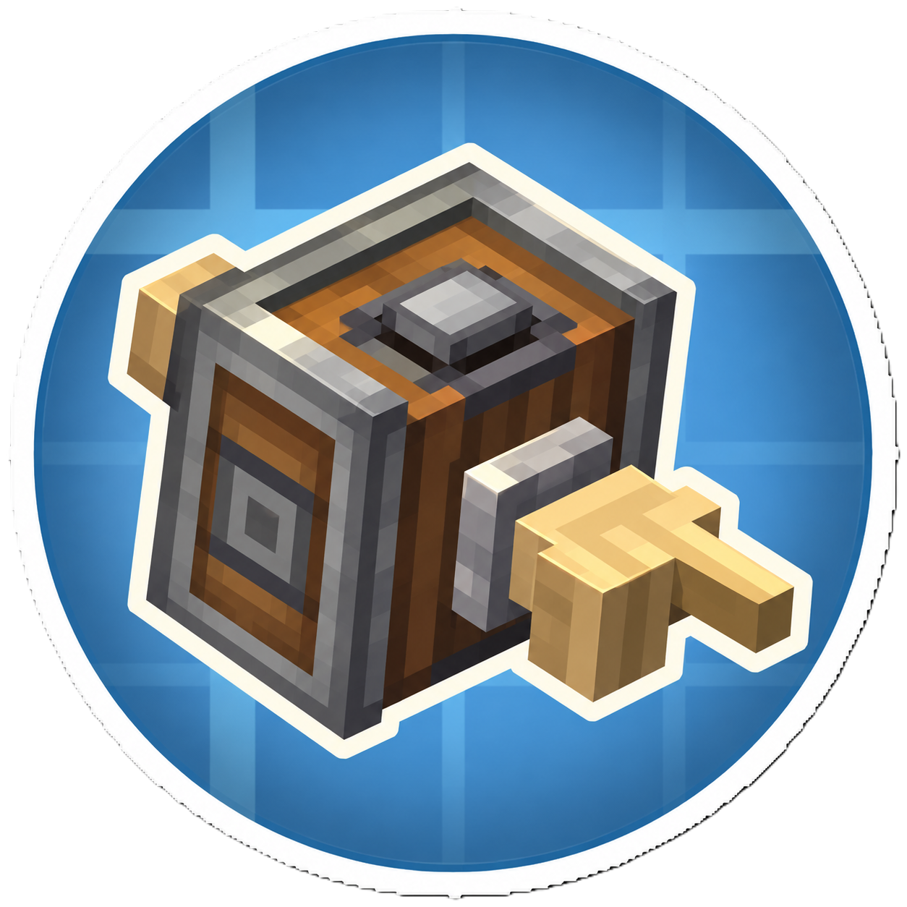

<p align="center"></p>

# Sable Deployer Rotation Fix

Candidate compatibility patch for Minecraft 1.21.1, Java 21, NeoForge 21.1.228, Create 6.0.10, Sable 2.0.3 and Companion 1.6.0.

Before Create's DeployerHandler.activate consumes its FakePlayer, convert the block entity's local FACING through its source SubLevel.logicalPose(). Existing Sable placement-context localization then handles the destination. No dependency source/JAR is changed or embedded. No Simulated/Aeronautics compile dependency is used.

## Build

Install Java 21 and point JAVA_HOME to it, then:

```sh
./gradlew clean build
```

Windows:

```bat
gradlew.bat clean build
```

Expected artifact after a successful build:
`build/libs/sable-deployer-rotation-fix-0.3.0.jar`

The source jar is not an installable mod. Do not rename a source jar to pretend it is a built mod.

`implementation` makes Create and Sable available on compileClasspath and the development runtime. It does not shade their classes. There is no jarJar/shadow configuration. Companion is explicitly compileOnly because its Pose types are exposed by Sable; the installed Sable provides its runtime dependency. Gradle wrapper is copied from the inspected upstream repository.

## Install and test

Put the built non-sources jar in the instance's `mods` directory alongside the specified mods. For multiplayer, install matching copies on the dedicated server and clients. No configuration is needed. Do not combine it with the upstream-patched Sable build or another patch for this method.

Use `./gradlew runClient` or `./gradlew runServer` for development. Place exact compatible optional test JARs in `runtime-mods/`; they are runtimeOnly and excluded from the output. Obtain Simulated/Aeronautics separately when needed to create/rotate bodies. Follow server EULA requirements yourself.

Metadata deliberately accepts only Sable 2.0.3 and Create 6.0.10, rather than claiming future or 1.2.2 compatibility. Related APIs in the 1.2.2 source are similar; binary/runtime compatibility is untested. Do not widen version ranges without rebuilding/testing. NeoForge versions earlier than 21.1.228 are not declared supported by this candidate.

License: MIT for this standalone implementation; Gradle wrapper retains its upstream license notices. Sable's separate source tree remains under its own license.

## Video demonstration of the fix

https://github.com/user-attachments/assets/aee172bc-c1dd-412f-b936-f1736aea5f69


